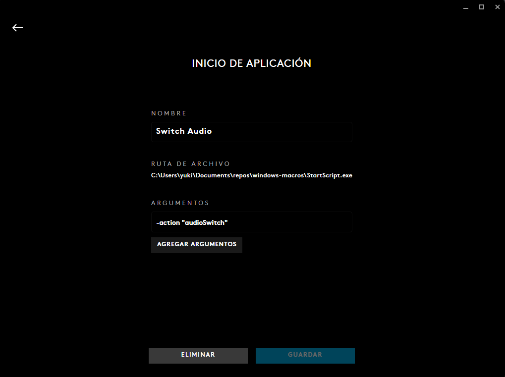

# Windows macros for g hub

Setup consists on setting up g hub macros as:



## Add more scripts

```powershell
Install-Module -Name ps2exe
#Add new actions on StartScript.ps1 and then
Win-PS2EXE
```
